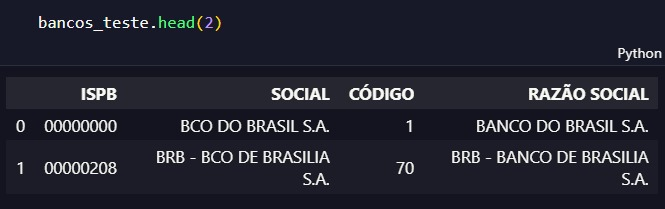

 

# Projeto Final 

## Construção de um pipeline de dados utilizando Python.

## Índice 📖

* <a href='#ferramentas-utilizadas'>Ferramentas utilizadas </a>
* <a href='#bibliotecas-utilizadas'>Importação das biliotecas</a>
* <a href='#conexão-com-o-banco-de-dados-local'>Conexão com o banco de dados local</a>
* <a href='#crianção-de-funções-auxiliares'>Crianção de funções auxiliares</a>
* <a href='#preenchimento-das-urls'>Preenchimento das URLs</a>
* <a href='#criação-dos-dataframes-através-de-apis'>Criação dos DataFrames através de APIs</a>
* <a href='#tratamento-individual-dos-dataframes-gerados'>Tratamento individual dos DataFrames gerados</a>
* <a href='#salvando-e-enviando-os-dataframes-para-o-banco-de-dados-local'>Salvando e enviando os DataFrames para o banco de dados local</a>

## Ferramentas utilizadas

- [] Python 3.0
- [] Visual Studio Code

## Bibliotecas utilizadas 
 - [] pandas
 - [] datetime
 - [] plyer
 - [] requests
 - [] numpy
 - [] sqlite3
 - [] json

## Conexão com o banco de dados local

```python
conn = sqlite3.connect('coderhouse.db')

```


## Crianção de funções auxiliares
``` python
def salva_bd(df, nome_tabela):
    conn = sqlite3.connect('coderhouse.db')
    df.to_sql(nome_tabela,conn,if_exists='replace',index = False)
    conn.close()
    return None

def carrega_bd(nome_tabela):
    conn = sqlite3.connect('coderhouse.db')
    query = f"select * from {nome_tabela}"
    df = pd.read_sql_query(query, conn)
    conn.close()
    return df


```

## Preenchimento das URLs

```python
urls = [ 
    'https://brasilapi.com.br/api/banks/v1', #bancos ok
    'https://brasilapi.com.br/api/cvm/corretoras/v1', #corretoras ok
    'https://restcountries.com/v3.1/all' #rest countries ok
]
```

## Criação dos DataFrames através de APIs

```python
def Extraçao():

    global df_bancos, df_corretoras, df_resties

    for url in urls:
        request = requests.get(url)
        response_code = request.status_code
        if response_code == 200:
            if url == 'https://brasilapi.com.br/api/banks/v1':
                df_bancos = pd.DataFrame(request.json())
                
            elif url == 'https://brasilapi.com.br/api/cvm/corretoras/v1':
                df_corretoras = pd.DataFrame(request.json())
                
            elif url == 'https://restcountries.com/v3.1/all':
                df_resties = pd.DataFrame(request.json())
                
            else:
                print('URL fora da base de dados.')
        else:
            nivel = 'ATENÇÃO: Erro Grave'
            Alerta(nivel = nivel, base = 'APIs', etapa = 'Extraçao')
```


## Tratamento individual dos DataFrames gerados
 


## Salvando e enviando os DataFrames para o banco de dados local 
